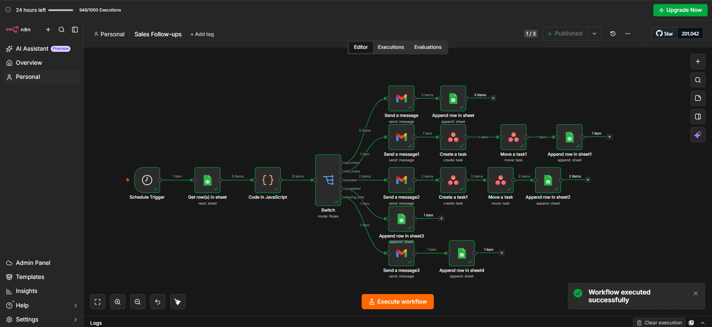
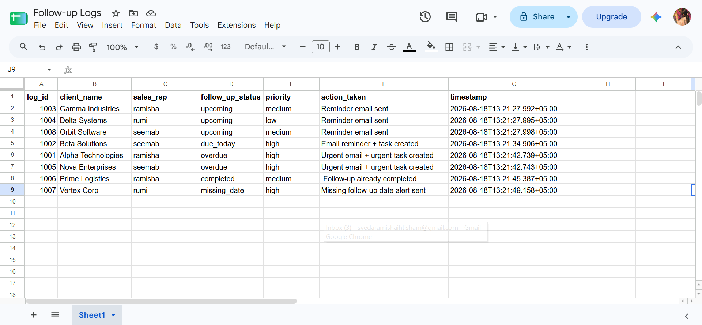
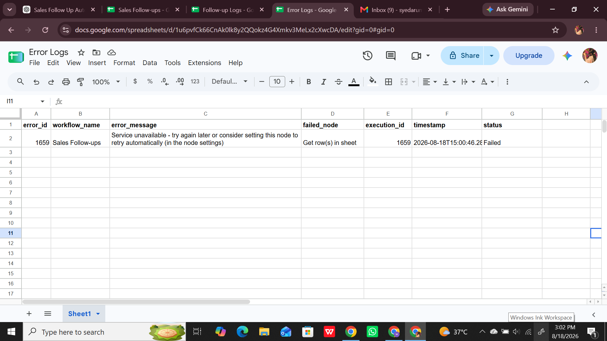

# 📈 Sales Follow-up Automation

An automated B2B sales follow-up management system built with **n8n**, **Google Sheets**, **Gmail**, and **Asana**.

The system automatically checks client follow-up dates, identifies upcoming, due-today, overdue, completed, and missing-date follow-ups, and takes the appropriate action so that important sales follow-ups are not missed.

## 🎯 Project Objective

B2B sales teams often manage multiple clients and follow-up dates manually. This can result in missed or delayed follow-ups.

This automation solves that problem by automatically:

* Checking sales follow-ups every day
* Identifying the follow-up status
* Sending appropriate email reminders
* Creating Asana tasks for urgent follow-ups
* Logging all automated actions
* Detecting missing follow-up dates
* Recording workflow errors separately

## 🔄 Main Workflow

```text
Schedule Trigger
       ↓
Google Sheets
       ↓
Calculate Follow-up Status
       ↓
Switch
       ├── Upcoming → Gmail → Follow-up Logs
       │
       ├── Due Today → Gmail → Asana → Follow-up Logs
       │
       ├── Overdue → Gmail → Asana → Follow-up Logs
       │
       ├── Completed → Follow-up Logs
       │
       └── Missing Date → Gmail → Follow-up Logs
```

## 🧠 Follow-up Status Logic

| Status       | Condition                       | Action                                 |
| ------------ | ------------------------------- | -------------------------------------- |
| Upcoming     | Follow-up date is in the future | Send reminder email                    |
| Due Today    | Follow-up date is today         | Send email + create Asana task         |
| Overdue      | Follow-up date has passed       | Send urgent email + create urgent task |
| Completed    | Follow-up is already completed  | Log only                               |
| Missing Date | No follow-up date exists        | Send review alert + log                |

## 🛠️ Technologies Used

* **n8n** — Workflow automation
* **Google Sheets** — Sales follow-up database and logging
* **Gmail** — Sales representative notifications
* **Asana** — Follow-up task management
* **JavaScript** — Follow-up date and status calculation

## 📊 Google Sheets

### Sales Follow-ups

The main sheet stores client and follow-up information.

```text
id
client_name
contact_person
email
sales_rep
sales_rep_email
follow_up_date
status
priority
last_contacted
notes
```

### Follow-up Logs

Every automated action is recorded for tracking and auditing.

```text
log_id
client_name
sales_rep
follow_up_status
priority
action_taken
timestamp
```

### Error Logs

Workflow failures are recorded separately by the error-handling workflow.

```text
error_id
workflow_name
error_message
failed_node
execution_id
timestamp
status
```

## 📧 Automated Email Notifications

Different messages are sent depending on the follow-up status.

### Upcoming

A normal reminder is sent to the assigned sales representative.

### Due Today

The sales representative receives a reminder that the follow-up needs to be completed today.

### Overdue

An urgent notification is sent when a follow-up has passed its scheduled date.

### Missing Date

The sales representative is notified when a client does not have a follow-up date assigned.

## 📋 Asana Task Automation

For important follow-ups, the workflow automatically creates Asana tasks.

### Due Today

Creates a task containing:

* Client name
* Contact person
* Email
* Sales representative
* Follow-up date
* Priority
* Notes

### Overdue

Creates an urgent task with the follow-up due today so that the sales representative can take immediate action.

## 🧮 JavaScript Status Calculation

The Code node calculates the follow-up status using the current date.

The logic identifies:

```text
overdue
due_today
upcoming
completed
missing_date
```

This status is then passed to the Switch node for routing.

## 🔀 Switch-Based Routing

The Switch node routes each client according to the calculated status.

```text
upcoming
    ↓
Gmail Reminder
    ↓
Follow-up Log

due_today
    ↓
Gmail Reminder
    ↓
Asana Task
    ↓
Follow-up Log

overdue
    ↓
Urgent Gmail
    ↓
Urgent Asana Task
    ↓
Follow-up Log

completed
    ↓
Follow-up Log

missing_date
    ↓
Gmail Alert
    ↓
Follow-up Log
```

## 🚨 Error Handling

A separate n8n error-handling workflow is included.

```text
Main Workflow Error
        ↓
Error Trigger
        ↓
Google Sheets
        ↓
Error Logs
```

The error handler records:

* Error ID
* Workflow name
* Error message
* Failed node
* Execution ID
* Timestamp
* Status

This provides an audit trail for workflow failures.

## 📸 Screenshots

### 1. Complete Workflow



### 2. Google Sheets


### 3. Gmail Reminders


### 4. Asana Tasks


### 5. Follow-up Logs



### 6. Error Logs



## 📁 Project Structure

```text
sales-follow-up-automation/
│
├── workflows/
│   ├── sales-follow-up-automation.json
│   └── sales-follow-up-error-handler.json
│
├── screenshots/
│   ├── workflow.png
│   ├── google-sheets.png
│   ├── gmail-reminders.png
│   ├── asana-tasks.png
│   ├── follow-up-logs.png
│   └── error-logs.png
│
├── README.md
└── .gitignore
```

## ✨ Key Features

* ⏰ Automated daily follow-up checking
* 📅 Date-based follow-up classification
* 📧 Automated sales representative reminders
* 🚨 Urgent alerts for overdue follow-ups
* 📋 Automatic Asana task creation
* ⚠️ Missing follow-up date detection
* 📝 Automated activity logging
* 🚨 Separate error-handling workflow
* 📊 Centralized Google Sheets tracking
* 🔀 Multi-path workflow routing

## 🎯 Expected Outcome

The automation helps ensure that important B2B sales follow-ups are not forgotten.

Instead of manually checking every client, the sales team receives the appropriate reminder or task based on the follow-up status.

## 👩‍💻 Author

**Syeda Ramisha Ihtisham**

AI Automation Engineer Intern

